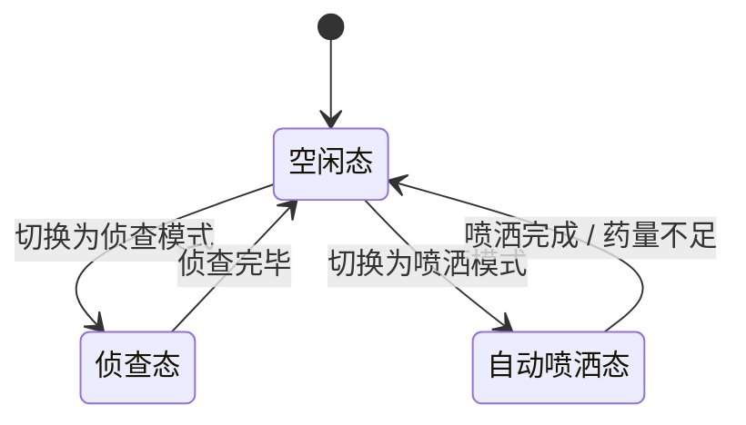
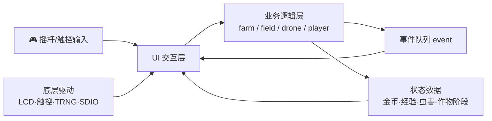

# 🌾 农田无人机喷洒农药模拟系统

<div align="center">

-blue?style=flat-square&logo=arm)


**一款运行在嵌入式平台上的硬核农场经营模拟游戏 —— 种植、虫害、无人机、策略升级，应有尽有。**

</div>

---

## 📖 目录

- [🎮 游戏概览](#-游戏概览)
- [🕹️ 核心玩法](#️-核心玩法)
  - [🌱 种植与作物生长](#-种植与作物生长)
  - [🐛 病虫害系统](#-病虫害系统)
  - [🚁 无人机系统](#-无人机系统)
  - [💰 经济与商店](#-经济与商店)
  - [🏆 经验与等级](#-经验与等级)
  - [📦 仓库与交易](#-仓库与交易)
  - [⚙️ 升级体系](#️-升级体系)
  - [💾 存档系统](#-存档系统)
  - [🔔 消息与事件](#-消息与事件)
  - [🎵 音效与音乐](#-音效与音乐)
- [🧱 架构设计](#-架构设计)
  - [总览](#总览)
  - [分层架构图](#分层架构图)
  - [数据/控制流](#数据控制流)
- [🧩 核心模块](#-核心模块)
- [🎨 UI 与交互](#-ui-与交互)
- [🔧 技术亮点](#-技术亮点)
- [🖥️ 硬件平台](#️-硬件平台)
- [👥 团队](#-团队)
- [📋 开发路线图](#-开发路线图)

---

## 🎮 游戏概览

> 你是一名农场主，拥有一片土地、一架无人机，以及无限的经营野心。

在资源受限的 **GD32H7 嵌入式单片机** 上，我们构建了一款完整的农场经营模拟游戏。游戏围绕 **「种植 → 生长 → 虫害 → 侦查 → 喷洒 → 收获 → 售卖 → 升级」** 的核心循环展开，深度融合了无人机自动作业、多维度升级策略、事件驱动 UI 刷新等机制，在嵌入式平台上实现了接近桌面级游戏的可玩性与交互体验。

---

## 🕹️ 核心玩法

### 🌱 种植与作物生长

| 作物 | 成熟时间 | 售价 | 特色 |
|:---:|:---:|:---:|:---|
| 🌾 **小麦** | 250 刻 (~4 min) | 40 金币 | 生长快，适合前期积累 |
| 🍚 **水稻** | 300 刻 (~5 min) | 60 金币 | 产量稳定，中期主力 |
| 🌽 **玉米** | 225 刻 (~3.7 min) | 80 金币 | 周期短，高回报 |

- 作物经历 **种子 → 幼苗 → 生长 → 开花 → 成熟 → 就绪** 六个阶段，每阶段在 UI 中有不同的图标表现。
- 生长节奏由 **1 秒心跳定时器** 驱动，每 tick 推进所有已种植田块的生长进度。
- 作物成熟后可**双击单个收获**，或使用 **一键收获全部成熟作物**，产物自动存入仓库。


### 🐛 病虫害系统

> ⚠️ 虫害是农场最大的敌人 —— 看不见的威胁，需要靠无人机侦查发现！

| 虫害 | 对应农药 | 危害特征 |
|:---:|:---:|:---|
| 🐜 **蚜虫** | 杀蚜剂 | 繁殖快，中等减产 |
| 🕷️ **螨虫** | 杀螨剂 | 隐蔽性强，持续损伤 |
| 🐛 **卷叶蛾** | 杀卷叶蛾剂 | 暴发性强，损伤率高 |
| 🦗 **蝗虫** | 杀蝗剂 | 毁灭性，致死风险大 |

- 虫害**随机发生**，不同生长阶段可能感染不同类型的虫害。
- 感染后作物**持续减产**（通过二次损伤模型曲线计算），若长时间不处理可能导致**作物死亡，田块清空**。
- 🔑 **关键设计**：虫害发生后，玩家**不知道虫害类型**，必须派遣无人机侦查才能获知！

> 📐 每种虫害拥有独立的二次损伤参数曲线 $(a, b, c)$，感染概率随生长进度 $t$ 变化：
>
> $$P_{\text{感染}}(t) = \max\Bigl(0,\ \min\bigl(1,\ a \cdot (t - b)^2 + c - \text{tolerance}\bigr)\Bigr) \cdot (1 - \text{tolerance})$$
>
> 各虫害参数（$a$ 控制曲线开口与陡峭度，$b$ 为峰值位置，$c$ 为峰值高度）：
>
> | 虫害 | $a$ | $b$ | $c$ | 高发阶段 |
> |:---|:---:|:---:|:---:|:---|
> | 蚜虫 | -6 | 0.20 | 0.95 | 幼苗期 |
> | 螨虫 | -5 | 0.50 | 0.98 | 生长期 |
> | 卷叶蛾 | -4 | 0.70 | 0.96 | 开花期 |
> | 蝗虫 | -3 | 0.85 | 0.90 | 成熟期 |
>
> 作物死亡为**确定性机制**：当产量因子 `factor` 因持续虫害衰减至阈值 0.3 以下时，作物死亡、田块清空。

### 🚁 无人机系统

无人机是游戏中最具策略性的玩法。它有三种状态：

| 状态 | 说明 |
|:---:|:---|
| 🟢 **空闲态** | 停留在农田上方，等待指令 |
| 🔵 **侦查态** | 由摇杆控制飞行，飞过田块时自动检测该地块虫害类型，结果实时显示在 HUD |
| 🟠 **自动喷洒态** | 按规划路径自动飞行，对已侦查田块喷洒匹配农药 |

**自动路径规划算法**：

贪心 + 2-opt 算法，路径更短更高效！

- 无人机拥有**药仓容量**，需在作业前装载对应农药。
- 侦查结果和剩余药量通过 **HUD 实时显示**。
- 同一田块可**多次感染虫害**，每次需重新侦查和喷洒。



### 💰 经济与商店

- 玩家初始获得 **500 金币**。
- 商店可购买 **种子**（3 种）和 **农药**（4 种），价格各有不同。
- 收获的作物存入仓库，在仓库中**售卖**换取金币。
- 所有购买受**等级折扣**影响 —— 等级越高，折扣越大（最高 7 折）。

### 🏆 经验与等级

| 操作 | 经验获取 |
|:---|:---:|
| 🌱 种植 | +2 EXP |
| 🌾 收获（小麦/水稻/玉米） | +2 / +3 / +4 EXP |
| 💊 喷洒农药 | +5 EXP |

- 经验累积后**自动升级**（共 40 级），等级划分 6 个阶段。
- 每个等级段对应不同的商店折扣率：

| 等级段 | 折扣率 |
|:---:|:---:|
| Lv.1–9 | 原价 (100%) |
| Lv.10–14 | 9.5 折 |
| Lv.15–19 | 9 折 |
| Lv.20–24 | 8.5 折 |
| Lv.25–29 | 8 折 |
| Lv.30–39 | 7.5 折 |
| Lv.40 | **7 折** 🔥 |

### 📦 仓库与交易

- 收获的作物自动存入**收获背包**，区分作物类型存放。
- 仓库界面可**批量售卖**任意数量的收获物，实时结算金币。
- 「一键收获所有成熟作物」支持批量操作，高效管理。

### ⚙️ 升级体系

游戏提供 **7 大升级维度**，构建丰富策略空间：

| 类别 | 升级项 | 等级 | 效果 | 生效范围 |
|:---:|:---|:---:|:---|:---:|
| 🚁 无人机 | 速度 | 0→3 | 移动速度 10→20→30→50 | 全局 |
| 🚁 无人机 | 药仓容量 | 0→3 | 载药量 10→20→30→50 | 全局 |
| 🚁 无人机 | 路径算法 | 0→2 | 全遍历→贪心→2-opt | 全局 |
| 🏞️ 农场 | 规模 | 0→3 | 4×4→5×5→6×6→7×7 | 全局 |
| 🌿 田块 | 产量 | 0→3 | 产量 +0%→+20%→+40%→+50% | 单块 |
| ⏱️ 田块 | 生长速度 | 0→3 | 时间 ×1.0→×0.9→×0.8→×0.7 | 单块 |
| 🛡️ 田块 | 耐虫性 | 0→3 | 抗性 +0→+0.1→+0.25→+0.4 | 单块 |

> 💡 **田块升级为「下一季生效」机制**：升级当季不影响正在生长的作物，收获后下一季自动应用升级效果。长按田块可打开升级窗口。
>
> 💡 **农场规模升级带来可耕种田块数量的指数增长**：从 16 块（4×4）到 49 块（7×7）。

### 💾 存档系统

- 基于 **SD 卡 + FATFS 文件系统** 实现游戏进度持久化。
- 每 **1 秒自动存档**（通过心跳定时器触发），保存农场、玩家、无人机全部状态。
- 掉电后重启可**自动恢复**游戏进度，无缝接续。
- 支持**无 SD 卡运行**：游戏可正常游玩，但不会存档且无声效（优雅降级）。

### 🔔 消息与事件

- 游戏内置**消息提示系统**，在种植、收获、虫害、升级等操作时弹出对应提示。
- 底层基于**环形事件队列**（`event` 模块）实现业务层与 UI 层的解耦通信：
  - 业务逻辑产生事件 → 推入环形队列
  - UI 层在主循环中消费事件 → 驱动界面刷新
- 事件驱动机制有效**降低了 UI 刷新频率**，在嵌入式平台上节省了宝贵的 CPU 资源。

### 🎵 音效与音乐

- 游戏内置**背景音乐（BGM）**，可在设置界面调整音量。
- 音效播放基于 **SAI + DMA 流式输出**，不阻塞主循环。
- 无 SD 卡时自动静默，不影响游戏运行。

---

## 🧱 架构设计

### 总览

系统遵循 **五层分层架构**，自上而下为：

```
┌────────────────────────────────────────────┐
│               UI 表现层 (LVGL)              │
│   主界面 / 窗口体系 / 农田网格 / HUD / 动画  │
├────────────────────────────────────────────┤
│            事件通信层 (event)               │
│         环形队列 · 解耦 · 异步刷新          │
├────────────────────────────────────────────┤
│            业务逻辑层 (modules)             │
│  farm · field · player · drone · data · store│
├────────────────────────────────────────────┤
│            核心调度层 (main loop)           │
│      主循环 · 心跳定时器 · 事件转发         │
├────────────────────────────────────────────┤
│            硬件驱动层 (Drivers)             │
│ LCD/TLI · 触控 · 摇杆 · SDIO/FATFS · TRNG  │
│   SAI音频 · EXMC SDRAM · DMA · USART       │
└────────────────────────────────────────────┘
```

### 数据/控制流



---

## 🧩 核心模块

| 模块 | 文件 | 职责 |
|:---|:---|:---|
| 🌾 **Farm** | `modules/farm.c/.h` | 农场全局管理：网格初始化、规模升级、定时生长推进、存档 |
| 🌿 **Field** | `modules/field.c/.h` | 单块田地的完整生命周期：种植、生长阶段、虫害感染、农药清除、收获、升级 |
| 👤 **Player** | `modules/player.c/.h` | 玩家状态管理：金币、经验、等级、种子/收获/农药背包、统一购买接口 |
| 🚁 **Drone** | `modules/drone.c/.h` | 无人机核心逻辑：状态切换、侦查、路径规划、药仓管理、坐标移动 |
| 📊 **Data** | `modules/data.c/.h` | 集中配置数据：价格表、经验表、升级表、损伤参数、名称映射 |
| 📡 **Event** | `modules/event.c/.h` | 环形事件队列：N 种事件类型，解耦逻辑层与 UI 层通信 |
| 🎨 **UI** | `ui/ui.c/.h` | LVGL 界面体系：主屏、窗口、网格、HUD、动画、拖拽播种 |
| 🔊 **Audio** | `ui/audio.c/.h` | 背景音乐播放、音量控制、SAI+DMA 流式输出 |

---

## 🎨 UI 与交互

基于 **LVGL v8.3** 构建完整的嵌入式图形界面：

- 🏠 **主界面**：农田网格可视化，每个田块显示作物图标与虫害标记
- 🛒 **商店窗口**：购买种子和农药，实时显示折扣后价格
- 📦 **仓库窗口**：查看收获物库存，批量售卖
- ⚙️ **设置窗口**：音量调节、存档管理
- 🚁 **无人机 HUD**：实时显示药仓余量、侦查结果、当前状态
- 🎯 **拖拽播种**：从种子栏拖拽种子图标到目标田块
- 📈 **升级窗口**：长按田块打开升级面板，独立升级三项属性
- 🕹️ **摇杆控制**：ADC 采样 + 方向映射，控制无人机移动

---

## 🔧 技术亮点

| 亮点 | 说明 |
|:---|:---|
| 🧠 **事件驱动架构** | 环形队列解耦业务与 UI，避免轮询开销，MCU 友好 |
| 📈 **非线性损伤模型** | 基于 logistic 曲线的虫害损伤模拟，不同虫害有不同参数曲线 |
| 💾 **SD 卡持久化** | FATFS 文件系统，每秒自动存档，掉电恢复；优雅降级支持无卡运行 |
| 🎵 **流式音频** | SAI + DMA 双缓冲音频输出，不阻塞主循环 |
| 🎲 **真随机数** | 利用 GD32H7 片内 TRNG 模块（NIST 模式）生成种子，确保虫害等事件的不可预测性 |
| 🧩 **模块化设计** | 业务逻辑与 UI 完全分离，每个 `.c/.h` 模块职责单一，便于测试与维护 |
| 🔄 **等级折扣系统** | 6 段等级折扣曲线，消费决策随等级动态变化 |

---

## 🖥️ 硬件平台

| 组件 | 型号/说明 |
|:---|:---|
| 🧠 **MCU** | GD32H7xx (ARM Cortex-M7, 主频最高 600MHz) |
| 🖥️ **显示** | TFT LCD，通过 TLI (RGB 接口) 驱动 |
| 👆 **触控** | Goodix GTxx 系列电容触摸屏 (I²C) |
| 🕹️ **摇杆** | ADC 采样双轴摇杆 |
| 🔊 **音频** | SAI 接口 + 外部功放 + 扬声器 |
| 💾 **存储** | microSD 卡 (SDIO 4-bit + FATFS) |
| 🧮 **外部 RAM** | SDRAM (EXMC 接口)，用作 LVGL 帧缓冲与堆 |
| 🎲 **TRNG** | 片内真随机数发生器 (NIST SP 800-90B) |

---

## 👥 团队

| 成员 | 分工 |
|:---:|:---|
| **刘俊辉** | UI 交互设计：LVGL 界面体系（主屏/窗口/网格/HUD/动画）、硬件驱动联调（LCD/触控/摇杆/音频） |
| **吴天宇** | 核心业务逻辑：Farm / Field / Player / Drone / Store / Event 模块、升级规则、主循环调度、数据配置、系统集成测试 |

> 🏫 人工智能 2503 班 · 嵌入式系统课程设计

---

## 📋 开发路线图

| 阶段 | 内容 | 状态 |
|:---:|:---|:---:|
| 需求分析 & 方案设计 | 玩法闭环、模块边界、数据结构与接口定义 | ✅ 已完成 |
| 底层环境搭建 | GD32H7 工程搭建、LCD/触控/摇杆/LVGL 移植 | ✅ 已完成 |
| 核心逻辑开发 | farm/field/player/drone/store/event 模块实现 | ✅ 已完成 |
| UI 主流程开发 | 主界面、农田网格、窗口交互、事件刷新 | ✅ 已完成 |
| 联调 & 稳定性修复 | 功能联调、边界错误修复、内存稳定性验证 | 🔄 进行中 |
| 收尾 & 验收 | 体验优化、数据持久化完善、文档与答辩 | 📅 计划中 |

---

<div align="center">

**🌾 从一颗种子开始，打造你的农业帝国 🚁**

</div>
